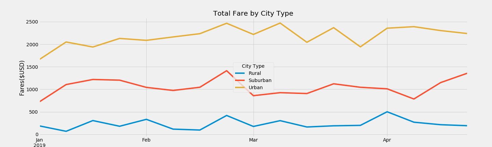

# Module 5 Challenge - PyBer

## Challenge Overview

1. Technical Analysis Deliverable 1: A DataFrame that summarizes the key metrics for the ride-sharing data by city type.

2. Technical Analysis Deliverable 2: A multiple-line chart, with one line for each city type, that shows the sum of the fares for each week.

3. Delivering Results: A written report explaining the results of both technical analyses.

## Resources

Data Source: city_data.csv, ride_data.csv

Software: Python 3.7.6 with Pandas, Numpy, and Matplotlib dependencies; Anaconda; Jupyter Notebook

## Challenge Summary

### 1. Summary DataFrame

*please see PyBer_challenge.ipynb for related code

### 2. Multiple-Line Chart for the Sum of the Fares for Each City Type

 

*please see PyBer_challenge.ipynb for related code

## 3. Written Analysis

### Backgroung and Results

The purpose of this assignment is to provide the CEO of PyBer a summary of total rides, total drivers and total fares per city type in order to determine the overall profitability of each city type as well as note any trends in total fares between the period January 01, 2019 to April 28, 2019 per city type. Data was first aggregated by the total rides, drivers, and fares by city type (Rural, Surburban, and Urban), then the average fare per ride and per driver was calculated to produce a summary of overall results by city type. Next, the data was reorganized by datestamp and summarized by week in order to create a new mulitiple line chart that displays the sum of the fares per city type per week across the period of January 1, 2019 to April 28, 2019. 

While the Urban city type generated the highest amount of total fares ($39.8k), average fare per driver was the lowest (AFpD = $16.57) as Urban city type was over saturated with drivers. Though Rural city type generated the lowest amount of total fares ($4.3k) for the period, average fare per ride and per driver were the highest (AFpR = $34.62 and AFpD = $55.49) due to the limited number of drivers, smaller population, and the probable greater distances required to travel. Further, between January 1, 2019 and April 28, 2019 it appears there was greater volatility of fare revenue for both Urban and Suburban city types while Rural city type appears to be very consistent. There is evidence that population density and geographic distance are major factors that contribute to the profitability per ride and per driver, while lifestyle contributes heavily to the daily useage of PyBer.

### Challenges Encountered and Overcome

Experienced challenges with final formatting of the line plot, specifically with re-labelling the x-ticks to the desired outcome. I had initially tried to change the overall grid but to no avail, and spend some time researching how to format line plots but was overwhelmed with all the various documentation and functionality. I also found it challinging to navigate the documentation provided by matplotlib pyplot and instead initially relied on various examples posted on sites like stackoverflow, geeksforgeeks, and datacamp. After spending some time researching different ways to change the structure of my graph, I heard a classmate explaining the same struggle to the instructor during Tuesday office hours, and paid attention to the solution the instructor provided. To ensure I was not simply copying code, spend some time afterwards re-reviewing the technical literature the instructor recommended to review to ensure I thoroughly understood the correction to my code. 

Source of information: https://matplotlib.org/3.2.1/api/_as_gen/matplotlib.pyplot.xticks.html

Initial Plot:

Code fix:

Final result:

### Recommendations and Next Steps

Additional analysis related to (A) the number of fares per city type per day of the week, as well as (B) the number of fares per city type per hour are recommended to provide further insight in the disparaty amongst city types.

(A) To perform this analysis, will need to calculate the number of fares per city type per day of the week and to organize the data with a clustered barchart to note which days of the week are the services utilized the most and if there is any difference between city types. Once we have an average weekly useage chart, we can further isolate only weeks that contain a holiday to note if there is any change in useage during a shortened work week. 

(B) To perform this analysis, will need to calculate the number of fares per city type per hour and organize the data with a cluster barchart to note any trends regarding time of day useage of PyBer between all city types. Once we have an average hourly useage chart, we can further isolate only weeks that contain a holiday to note if there is any change to useage during a shortened work week.

Both recommended analyses would be useful for marketing purposes as PyBer can gear their promotions during low points based on both analyses to help boost revenue. 

## Report Completed By:

